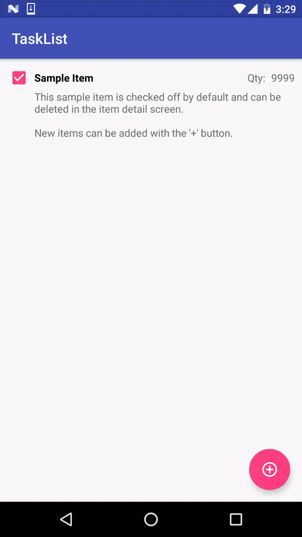

# TaskList

Simple Android application containing a list of items where a user can do any of the following with the items:
- Add
- Edit
- Delete
- Check off

The purpose was to explore [Realm DB](https://www.realm.io) instead of SQLite.

